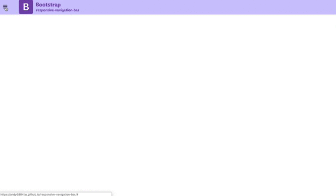

# [Dashboard collection](https://github.com/andy6804tw/)

All the projects are based on [Bootstrap4](http://startbootstrap.com/) framework .

## Preview

<table>
    <tbody>
        <tr>
            <td>
                 
                <a href="https://andy6804tw.github.io/responsive-navigation-bar/">responsive-navigation-bar</a>
            </td>
            <td>
                 
                <a href="https://andy6804tw.github.io/sb-admin/sb-admin">SB admin</a>
            </td>
            <td>
                 
                <a href="https://andy6804tw.github.io/sb-admin/sb-admin">SB admin</a>
            </td>
        </tr>
        <tr>
            <td>
            </td>
            <td>2</td>
        </tr>
    </tbody>
</table>

## Status

## Download and Installation

To begin using this template, choose one of the following options to get started:

-   Clone the repo: `git clone https://github.com/andy6804tw/.git`
-   [Fork, Clone, or Download on GitHub](https://github.com/andy6804tw/)

## Bugs and Issues

Have a bug or an issue with this template? [Open a new issue](https://github.com/andy6804tw//issues) here on GitHub.

## Copyright and License

Copyright (c) 2019 Yi Lin Tsai. Code released under the [MIT](https://github.com/andy6804tw//blob/master/LICENSE) license.
